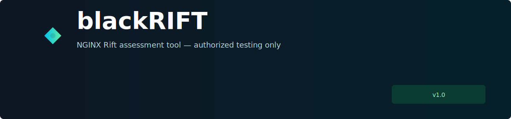

# blackRIFT

<p align="center">
  
</p>

blackRIFT is a compact assessment-first tool for authorized NGINX Rift testing. It wraps the `nginx_rifter.py` workflow into a minimal repo and supports both single-target checks and subdomain fan-out through `subfinder`.

Use it only against systems you own or are explicitly authorized to test.

## Files

- `nginx_rifter.py` - main tool
- `README.md` - this guide

## Requirements

- Python 3.10+
- `subfinder` in `PATH` when using domain fan-out
- A target with an HTTP-accessible local file read primitive matching the selected options

Check dependencies:

```bash
python3 --version
command -v subfinder
```

## Quick Start

Single target:

```bash
python3 nginx_rifter.py --target 127.0.0.1:19321
```

Domain fan-out with automatic `subfinder -all`:

```bash
python3 nginx_rifter.py \
  --target example.com \
  --scheme https \
  --port 443 \
  --subfinder-output scans/subfinder_all_example.txt
```

Disable automatic subfinder for a domain-shaped host:

```bash
python3 nginx_rifter.py --target example.com --no-subfinder --scheme https --port 443
```

Limit fan-out during testing:

```bash
python3 nginx_rifter.py --target example.com --port 443 --subfinder-max-hosts 10
```

## Exploit Mode

By default, blackRIFT runs assessment only. Explicit exploitation requires `--exploit --cmd ...`.

```bash
python3 nginx_rifter.py \
  --target 127.0.0.1:19321 \
  --exploit \
  --cmd id
```

When using subfinder fan-out, exploit mode is blocked unless you explicitly opt in:

```bash
python3 nginx_rifter.py \
  --target example.com \
  --port 443 \
  --exploit \
  --cmd id \
  --allow-multi-exploit
```

## Output

Assessment artifacts are written to `artifacts/` by default. In subfinder mode, each target gets its own JSON artifact named with the host and port.

```bash
python3 nginx_rifter.py --target example.com --port 443 --artifact-dir artifacts
```

## Notes

- `--target HOST:PORT` keeps the original single-target behavior.
- `--target DOMAIN` without a port automatically runs `subfinder -d DOMAIN -all -silent`.
- Use `--port 80` or `--port 443` for normal web targets; the inherited default port is `19321` for lab compatibility.
- Use `--advanced-help` for low-level exploit tuning flags.
